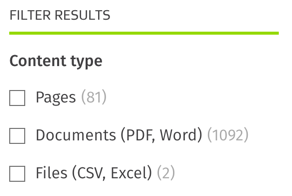

# Usage
This file details common usage scenarios.

**Table of contents:**
<!-- START doctoc generated TOC please keep comment here to allow auto update -->
<!-- DON'T EDIT THIS SECTION, INSTEAD RE-RUN doctoc TO UPDATE -->

- [The `AppSearchService` class](#the-appsearchservice-class)
- [The `SearchQuery` class](#the-searchquery-class)
  - [The keyword](#the-keyword)
  - [Filtering results](#filtering-results)
  - [Add Facets to your results](#add-facets-to-your-results)
  - [Result fields (highlighting search keyword)](#result-fields-highlighting-search-keyword)
  - [Search fields](#search-fields)
  - [Sorting Results](#sorting-results)
  - [Clickthrough Analytics](#clickthrough-analytics)
    - [Using custom `DataObject` classes with clickthrough tracking](#using-custom-dataobject-classes-with-clickthrough-tracking)
    - [Disabling clickthrough tracking](#disabling-clickthrough-tracking)
    - [Adjust the URL used for clickthrough tracking](#adjust-the-url-used-for-clickthrough-tracking)
  - [Pagination](#pagination)
- [Advanced usage](#advanced-usage)

<!-- END doctoc generated TOC please keep comment here to allow auto update -->

## The `AppSearchService` class

`AppSearchService` is your typical entry point to the module. You create a `SearchQuery` object, pass it into `AppSearchService`, and do your own processing on the `SearchResult` object that you get back.

For an overview of how to use the classes, see [simple-usage.md](simple-usage.md).

## The `SearchQuery` class
`SearchQuery` is where you configure the search query itself that you want to submit to Elastic App Search. Most of what you can do with [Elastic App Search itself](https://github.com/elastic/app-search-php#search) can be done through this class - if anything is missing please raise an issue or contribute the addition via a pull request.

### The keyword
Specify the keyword (or words) you want to search for using `$query->setQuery('search keywords')`. Subsequent calls to this method will override older values.

```php
use SilverStripe\ElasticAppSearch\Query\SearchQuery;

$query = SearchQuery::create();
$query->setQuery('keywords to search for');
```

### Filtering results
You can specify raw App Search filters through to `SearchQuery` using the `addRawFilters()` method. For now, these should be passed in the exact way that the [elastic/app-search-php module expects](https://swiftype.com/documentation/app-search/api/search/filters). An example of this is below:

```php
use SilverStripe\ElasticAppSearch\Query\SearchQuery;
use Elastic\EnterpriseSearch\AppSearch\Schema\SimpleObject;

$filters = new SimpleObject();

// Filters that all records must have to be included in the results
$filters->all = [];
$filters->all[] = (object)['content_type_id' => 12345];

// 'OR' conditionals - only one of each has to match to include the document in the results
$filters->any = [];
$filters->any[] = (object)['title' => 'Text string'];
$filters->any[] = (object)['content' => 'Text string'];

// Ensure that no document that matches this filter is included in the results
$filters->none = [];
$filters->none[] = (object)['title' => 'Text string'];

// Apply the filters:
$query = SearchQuery::create();
$query->addRawFilters($filters);

// Lots more examples are available here: https://swiftype.com/documentation/app-search/api/search/filters
```

### Add Facets to your results
Facets are most commonly used to show users information in advance of selecting filters. For example, you can show that for the current query, if a user was to add an additional filter on a taxonomy term, they would only get 5 results page.

You can return this metadata alongside your results by adding raw App Search facets to `SearchQuery` via the `addRawFacets()` method. Like [filters](#filtering-results), these should be passed in as a `SimpleObject` in the format that the [elastic/app-search-php module expects](https://swiftype.com/documentation/app-search/api/search/facets). Here's what it can look like:



Here's how you can achieve something like this, using taxonomy terms as an example:
```php
use SilverStripe\ElasticAppSearch\Query\SearchQuery;
use Elastic\EnterpriseSearch\AppSearch\Schema\SimpleObject;

$facets = new SimpleObject();

// The property you would like to return facet information on
$facets->taxonomy_terms = [];

$facets->taxonomy_terms[] = (object) [
    'type' => 'value', // this will essentially return a count
    'name' => 'topics', // [Optional] a name for this facet, in case you want to return multiple facets on the same property
    'sort' => (object) ['count' => 'desc'], // [Optional] can also be sorted by value (say, alphabetically)
    'size' => 250, // [Optional] the maximum amount returned, max 250, default 10
];

// Apply the facets:
$query = SearchQuery::create();
$query->addRawFacets($facets);
```

You can access these values via the `->getFacets()` method on `SearchResult`, it will return it in an `ArrayList`, or to get one particular facet, you can use the `->getFacet()` method. In this case , `->getFacet('taxonomy_terms', 'topics')`.

**Note:** if you don't use the name parameter when creating the query, it will be returned as index `0` - you can access this by omitting the second parameter to `->getFacet()` i.e. `->getFacet('taxonomy_terms')`

You can use these values in templates:

```html
<% loop $SearchResults.Facets %>
    <h1>$Name</h1>
    <h4>$Property</h4>
    <% loop $Data %>
        <p>$Value was returned $Count times</p>
    <% end_loop %>
<% end_loop %>
```

### Result fields (highlighting search keyword)
[Result Fields](https://swiftype.com/documentation/app-search/api/search/result-fields) are convenient ways to ask Elastic to return contextual information on why a document was returned in search results. This is often known as 'context highlighting' or 'excerpt content'. For example, a search for `test` would return the following result field for the page title if requested: `This is a <em>test</em> page`.

```php
use SilverStripe\ElasticAppSearch\Query\SearchQuery;

// Request an HTML snippet of an indexed field, with an optional maximum character length (default 100, range between 20 and 1000 characters)
$query = SearchQuery::create();
$query->addResultField('title', 'snippet');
$query->addResultField('content', 'snippet', 500);
```

Snippets are returned to your template as additional values within each returned object that you can access as properties of `$ElasticSnippets`. For example:

```html
<% loop $Results %>
    <li>
        <%-- Use the title snippet if it exists, fallback to the $Title from the page itself if it doesn't --%>
        <a href="$Link"><% if $ElasticSnippets.title %>$ElasticSnippets.title<% else %>$Title<% end_if %</a><br />
        <%-- Use the content snippet if it exists, and don't display anything if it didn't match --%>
        $ElasticSnippets.content
    </li>
```

**Note:** If the keyword doesn't match anything in the request field (e.g. the keyword doesn't exist in the `title` field), the snippet may be blank - so you should always consider having a default value.

Silverstripe CMS also has a built-in way to return a similar value - see [Text#ContextSummary](https://api.silverstripe.org/3/Text.html#method_ContextSummary), however this is much more memory intensive.

### Search fields
By default, Elastic will search all text fields on every document that matches all filters in the engine that you're querying. This _can_ be slow, especially if you index a lot of text fields. It can also return unwanted results (e.g. searching for a common keyword in all text fields might return results that you're not expecting).

You can use this feature to cut down on the fields that you want to search. This only works for fields in the schema that you designate as `text`.

You can optionally specify a weighting to give the text field you want to search. The higher the weighting, the more important the field is (relative to other specified fields). Weights should be between 1 (least relevant) and 10 (most relevant). If no weights are specified, then the engine-level weights (specified in the Elastic App Search console) are used.

**Note:** Defining weights for any search field overrides **all** weights as defined in the Elastic App Search console - leading to customer confusion.

The below example will ensure the quey only searches the `title` and `content` fields.
```php
use SilverStripe\ElasticAppSearch\Query\SearchQuery;

$query = SearchQuery::create();
$query->addSearchField('content'); // Don't specify a weight for content, the default will be used
$query->addSearchField('title', 10); // Make title the most relevant field
```

### Sorting Results

The default sort is `_score`, which is essentially relevance. You can add one or more sorts to help organise your results via the `SearchQuery` class:

```php
use SilverStripe\ElasticAppSearch\Query\SearchQuery;

$query = SearchQuery::create();
// For a single sort, just pass the field and direction to addSort()
$query->addSort('publication_date', 'asc');

// For multiple sorts, pass an array to addSorts()
$query->addSorts([
    'publication_date' => 'desc',
    'title' => 'asc',
]);
```

If you add any sort at all, a final sort of `'_score' => 'desc'` is appended to the end as the final tiebreaker.

**Note:** You cannot sort on a Geolocation field.

See [the Elastic documentation](https://www.elastic.co/guide/en/app-search/current/sort.html) for more details.

### Clickthrough Analytics
By default, clickthrough tracking is enabled to ensure analytics within Elastic App Search are populated.

All you need to do is ensure that when you link to an object, you use `$ClickthroughLink` instead of `$Link`.

#### Using custom `DataObject` classes with clickthrough tracking
By default, the module is pre-configured to accept click through tracking for common SilverStripe `DataObject` base classes like `SiteTree`, `File` and `Member`. If you are indexing any custom `DataObject` classes (e.g. `Document extends DataObject`), you'll need to add these to the shortname to FQCN mapping with some YML. This allows the click data to not expose FQCNs to the user.

```yml
SilverStripe\ElasticAppSearch\Service\AppSearchService:
  classname_to_type_mapping:
    'App\Document': 'doc'
```

#### Disabling clickthrough tracking
If tracking like this is not desired it can be disabled by setting the following YML flag:
```yaml
---
Name: disable-eas-analytics
After: '#elasticappsearch-analytics'
---
SilverStripe\ElasticAppSearch\Service\SearchResult:
    track_clickthroughs: false
```

After disabling this, update your search results templates to not use `$ClickthroughLink` - instead, just use `$Link` directly.

#### Adjust the URL used for clickthrough tracking
Alternatively, you may want to adjust the URL through which clicktracking happens. By default this is https://<website>/_click/<base64 encoded data>. If the `_click` portion conflicts with an existing rule or you want to change it, you can add the following YML (just ensure you set the same base route for both values or it won't work):

```yaml
SilverStripe\Control\Director:
    rules:
        '_custom_click_route': SilverStripe\ElasticAppSearch\Controller\ClickthroughController
SilverStripe\ElasticAppSearch\Controller\ClickthroughController:
    base_url: '_custom_click_route'
    url_handlers:
      '_custom_click_route': 'index'
```


### Pagination
By default, this module automatically handles the pagination of results for you, provided you use the built-in `PaginatedList` class (used by default). However, if you want to override this, you can call `$query->setPagination($pageSize, $pageNum)` to configure it directly:

**Note:** Page numbers in Elastic App Search are a one-based index (e.g. starting at 1). The Silverstripe CMS `PaginatedList` class is a zero-based index (starting at `0`). If you don't use the built-in pagination settings, you will need to account for this (e.g. by incrementing `$currentPageNum` when calling `setPagination`).

```php
use SilverStripe\ElasticAppSearch\Query\SearchQuery;

// Below will result in Elastic returning results 81 - 100
$query = SearchQuery::create();
$query->setPagination($pageSize = 20, $currentPageNum = 4);
```
## Advanced usage
There are some more advanced topics that have their own pages as well.
* [View detailed instructions for enabling the spellcheck / "Did you mean" feature](usage-spellcheck.md)
* [View detailed instructions for making multiple queries at once](usage-multisearch.md)
